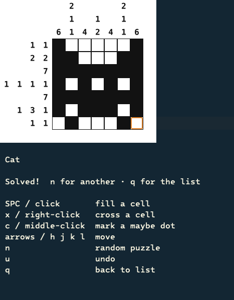

# Nonogram for Emacs

Play nonogram puzzles (also known as picross, griddlers or hanjie) in Emacs.

Requires Emacs 27.1 or later, built with SVG support (librsvg).

Fill the grid so that each row and column matches its clue numbers and a hidden picture appears. Puzzles are plain `.non` files (Steven Simpson's format, as exported by [webpbn.com](https://webpbn.com)), and the package can download and update them from a remote source.

## Buffers

### Puzzle list (`M-x nonogram`)

The 33 bundled puzzles are ordered from easiest to hardest, growing from small 5×5 pictures to an 80×95 one:

```
 Nonogram   RET play   U update   q quit

Plus                          5×5
T                             5×5
A                             5×5
...
Ring                          15×15
Rhombus                       15×15
Big heart                     20×20
Scardy Cat                    20×20
Party at the Right [...]      27×23
Probably Not                  34×34
Swing                         45×45
You light up my life          50×45
For Merka                     55×60
Faase                         80×95
```

### Game board (`RET` on a puzzle)

The board is drawn with SVG; every cell, including the clue numbers, sits on a solid white background. The clue numbers frame the grid on the top and left:



Below the board a legend lists the controls. A cell can be empty, filled (black), crossed out in red for cells you rule out, or marked with a small dot for cells you suspect are filled.

## Keymap

### Puzzle list

| Key               | Description                   |
|-------------------|-------------------------------|
| `RET` / `mouse-1` | Play the puzzle at point      |
| `n` / `p`         | Move down / up                |
| `U`               | Download / update the puzzles |
| `g`               | Refresh the list              |
| `q`               | Quit                          |

### Game board

| Key                | Description                    |
|--------------------|--------------------------------|
| `SPC` / `mouse-1`  | Toggle a filled (black) cell   |
| `x` / `mouse-3`    | Toggle a cross mark            |
| `c` / `mouse-2`    | Toggle a dot hint              |
| arrows / `h j k l` | Move the cursor                |
| `n`                | Load a random puzzle           |
| `u`                | Undo the last mark             |
| `q`                | Back to the puzzle list        |

## Installation

### use-package with :vc (Emacs 29+)

```elisp
(use-package nonogram
  :vc (:url "https://git.andros.dev/andros/nonogram.el"
       :rev :newest))
```

### use-package with :load-path

For manual installation or Emacs < 29:

```elisp
(use-package nonogram
  :load-path "/path/to/nonogram.el")
```

## Usage

1. Run `M-x nonogram` to open the puzzle list.
2. Move with `n` and `p` and press `RET` to play the puzzle at point.
3. Fill cells with `SPC` (or left-click), cross out cells with `x` (right-click) and leave dot hints with `c` (middle-click).
4. You win when the filled cells match every row and column clue.
5. Press `q` to return to the list, or `n` for a random puzzle.

If the puzzle directory is empty the first time you open the list, Nonogram offers to download a set of puzzles. Press `U` in the list, or run `M-x nonogram-download-puzzles`, to re-download and update them at any time.

## Puzzle format

Puzzles are `.non` files in Steven Simpson's format:

```
title "Smiley"
width 8
height 8
rows
6
1,1
...
columns
5
1,1
...
goal "0111111010000001..."
```

Clue blocks within a line are comma-separated. If a file omits the `rows` and `columns` clues, they are derived from the `goal` grid.

## Adding puzzles

Drop `.non` files into `nonogram-puzzle-directory` (or, to share them through the download feature, commit them under `puzzles/` in the repository and push; the directory is listed dynamically, so `U` / `M-x nonogram-download-puzzles` picks them up automatically).

The list is sorted by file name, so the bundled puzzles use a numeric prefix (`01-`, `02-`, …) to order them by difficulty. The prefix is not shown in the list; only the `title` field is. Follow the same convention to slot a new puzzle into the ramp.

There are two easy ways to get a `.non` file:

**Export an existing one.** Pick a puzzle on [webpbn.com](https://webpbn.com), open the export tool at [webpbn.com/export.cgi](https://webpbn.com/export.cgi), choose the **NON — Steve Simpson** format and save the result with a `.non` extension. Note that most webpbn puzzles are copyrighted by their authors; only redistribute the ones whose author allows it (see the [webpbn survey](https://webpbn.com/survey/), which lists puzzles released under a Creative Commons licence).

**Write one by hand.** Only the picture is required, since the clues are derived from it:

```
title "Star"
width 5
height 5
goal "0010011111011101111100100"
```

The `goal` is the grid read left to right, top to bottom, with `1` for a filled cell and `0` for an empty one (here, five rows of five). Add explicit `rows` and `columns` clue lines only if you want to override the derived clues.

Online resources:

- [webpbn.com](https://webpbn.com) — create, browse and export puzzles.
- [webpbn.com/export.cgi](https://webpbn.com/export.cgi) — export tool with the NON format.
- [webpbn.com/survey](https://webpbn.com/survey/) — puzzle sets, some under Creative Commons.

## Customization

Run `M-x customize-group RET nonogram RET` to list all available options.

Key options:

- `nonogram-cell-px` (default `26`): size in pixels of each board cell.
- `nonogram-puzzle-directory`: directory scanned for `.non` files (default: the `puzzles` directory next to the package).
- `nonogram-puzzle-source-url`: Gitea contents-API URL listing the downloadable puzzles.
- `nonogram-auto-download` (default `t`): offer to download puzzles when the directory is empty.
- `nonogram-background-color` (default `"#FFFFFF"`): board background, drawn as a solid SVG fill.
- `nonogram-filled-color` (default `"#111111"`): filled cells and grid lines.
- `nonogram-cross-color` (default `"#B03030"`): cross marks.
- `nonogram-dot-color` (default `"#111111"`): dot hints.
- `nonogram-clue-color` (default `"#111111"`): clue numbers.
- `nonogram-cursor-color` (default `"#E8901A"`): the ring that marks the cursor.

## Contributing

Contributions are welcome! Please see the [contribution guidelines](https://git.andros.dev/andros/contribute) for instructions on how to submit issues or pull requests.

## License

This program is free software; you can redistribute it and/or modify it under the terms of the GNU General Public License as published by the Free Software Foundation, either version 3 of the License, or (at your option) any later version.

This program is distributed in the hope that it will be useful, but WITHOUT ANY WARRANTY; without even the implied warranty of MERCHANTABILITY or FITNESS FOR A PARTICULAR PURPOSE. See the GNU General Public License for more details.

You should have received a copy of the GNU General Public License along with this program. If not, see [https://www.gnu.org/licenses/](https://www.gnu.org/licenses/).

The puzzles authored by Andros Fenollosa are released under CC0-1.0. The remaining puzzles come from the sample set of Jan Wolter's [Survey of Paint-by-Number Puzzle Solvers](https://webpbn.com/survey/); their authors gave permission to redistribute them freely as long as the attribution is kept (an arrangement the survey describes as equivalent to a Creative Commons Attribution licence). Each `.non` keeps its `by` and `copyright` fields, and [CREDITS.md](CREDITS.md) lists them.
